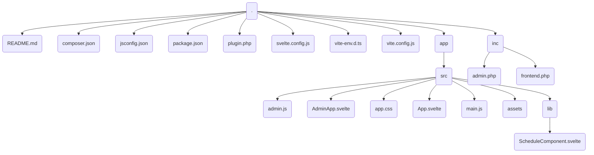

# Plan: WordPress Scheduling Plugin (wp-schedule-plugin)

This plan outlines the steps to create the initial file structure and content for the WordPress scheduling plugin using Svelte 4 and Vite, based on the provided specifications. All file paths are relative to the current directory (`/Users/johan/Local Sites/test3/app/public/wp-content/plugins/wp-schedule-plugin`).

**Author:** Johan Beijer

**Namespace:** `JohanBeijer\WPSchedule`

## Plan Steps:

1.  **Create Directory Structure:** Establish the main directories (`app/src/assets`, `app/src/lib`, `inc`) directly within the current working directory.
2.  **Create `composer.json`:** Write the content with updated name.
3.  **Create `package.json`:** Write the provided content.
4.  **Create `plugin.php`:** Write the content with updated namespace and author.
5.  **Create `vite.config.js`:** Write the provided content.
6.  **Create `svelte.config.js`:** Write the provided content.
7.  **Create `jsconfig.json`:** Write the provided content.
8.  **Create `vite-env.d.ts`:** Write the provided content.
9.  **Create `inc/frontend.php`:** Write the content with updated namespace.
10. **Create `inc/admin.php`:** Write the content with updated namespace.
11. **Create `app/src/main.js`:** Write the provided content.
12. **Create `app/src/admin.js`:** Write the provided content.
13. **Create `app/src/app.css`:** Write the provided content.
14. **Create `app/src/App.svelte`:** Write the provided content.
15. **Create `app/src/AdminApp.svelte`:** Write the provided content.
16. **Create `app/src/lib/ScheduleComponent.svelte`:** Write the provided content.
17. **Create `README.md`:** Create an empty README.md file as a placeholder.

## Visualized Directory Structure (Mermaid):

## Status

Initial file structure creation is complete. Development now follows the phases outlined in `PLAN-FÖR_ANPASNING.md`. Fas 0 and Fas 1 are complete.